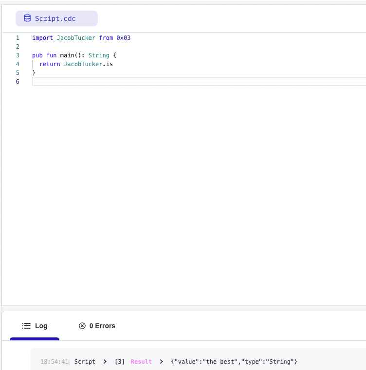

# Lesson 1

## 1.1 - Learning Blockchain Concepts

1. Explain what the Blockchain is in your own words.
A blockchain is an open, decentralized database. It's a ledger that stores the transactions that are performed are chain.
Interactions with the blockchain are through smart contracts.

2. Explain what a Smart Contract is.
A smart contract defines the way we can interact with the blockchain, almost like an API for blockchains.

3. Explain the difference between a script and a transaction.
A script reads from the blockchain and doesn't alter any data.
A transaction is able to change the data on a blockchain and often costs to perform.

## 1.2 - The Flow Blockchain & Cadence

1. What are the 5 Cadence Programming Language Pillars?

- Safety and security: Focuses on making smart contracts secure through a strong type system, separation between contracts and transactions, and resource oriented programming.
- Clarity: Makes code easy to read (and write), so that audits and reviews in place can help with reinforcing the security of the language
- Approachability: Written in a familiar way to other progrmaming languages, making it easy to transition to learning and writing Cadence.
- Developer experience: Clear error messages allow for better debugging.
- Resource oriented programming: Moves resources around to model ownership and resources on the blockchain.

2. In your opinion, even without knowing anything about the Blockchain or coding, why could the 5 Pillars be useful?

- Safety and security: While blockchain itself is highly secure, the "hacks" are often caused by bugs created by developers. By focusing on safety and security in smart contracts, it lessens the possibility of these occurrences. This improves the public trust of the technology and its use cases and furthers the development and adoption of blockchain
- Clarity: This goes hand in hand with safety and security. By making clarity a focus, Cadence allows the readers and writers of the language can verify that the code is safe.
- Approachability: As a new programming language (on a new blockchain), Cadence's emphasis on aproachability allows more developers to learn the language more easily
- Developer experience: By soothing out the experience for developers, it increases its adoption and furthers its development. It lessens the occurence of bugs, which makes the code safer and more secure

## 2.1 Our First Smart Contract

In Contract1.cdc

```
pub contract JacobTucker {
    
    pub let is: String 

    init() {
        self.is = "the best"
    }
}
```



## 2.2 Transactions and Scripts 

1. Explain why we wouldn’t call changeGreeting in a script.
We're mutating data so it must be a transaction. Scripts can only read data. Transactions can do both

2. What does the AuthAccount mean in the prepare phase of the transaction?
AuthAccount represents the authorized portion of an account. Signed transactions can get access to the AuthAccount, which means it has access to the acocunt's storage, public keys, and code. 

3. What is the difference between the prepare phase and the execute phase in the transaction?
Prepare phase can access the data in the account. Execute phase cannot do that. Rather, it can call functions and perform the logic. The separation helps with clarity.

```
pub contract JacobTucker {
    
    pub let is: String 
    pub var myNumber: Int

    pub fun updateMyNumber(newNumber: Int) {
        self.myNumber = newNumber
    }

    init() {
        self.is = "the best"
        self.myNumber = 0
    }
}
```


```
import JacobTucker from 0x03

transaction(myNewNumber: Int) {

  prepare(acct: AuthAccount) {}

  execute {
    JacobTucker.updateMyNumber(newNumber: myNewNumber)
  }
}

```


```
import JacobTucker from 0x03;

pub fun main(): Int {
  return JacobTucker.myNumber
}

```